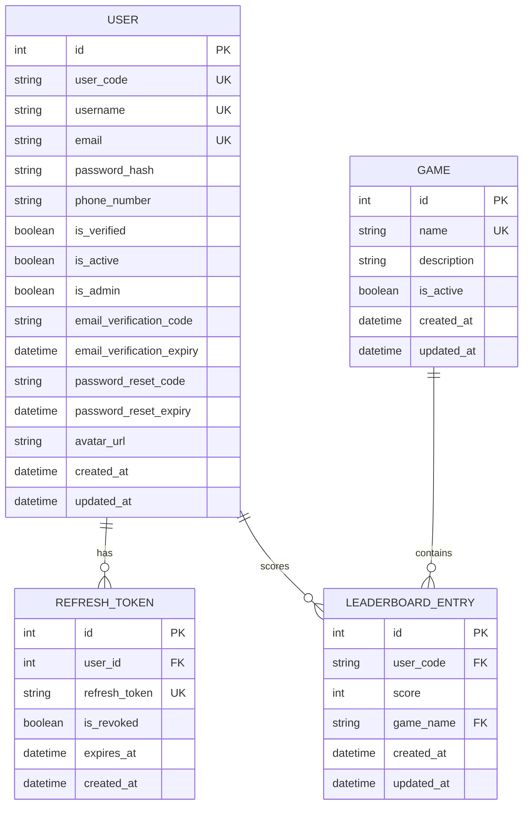
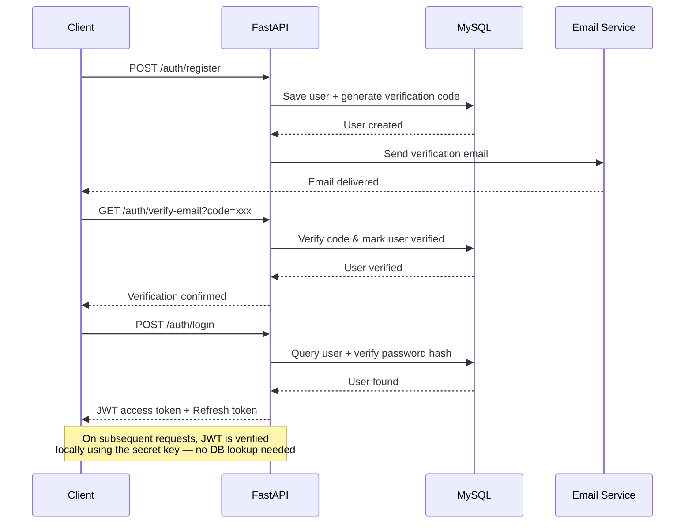
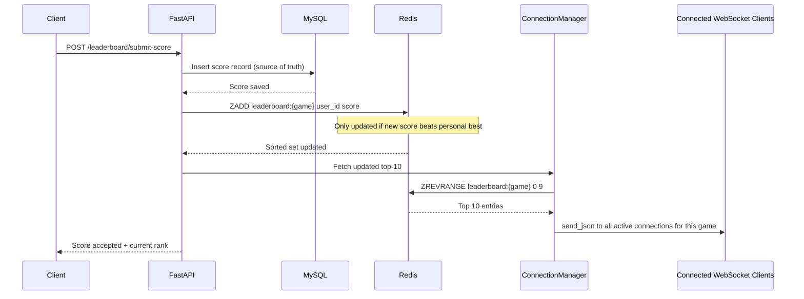
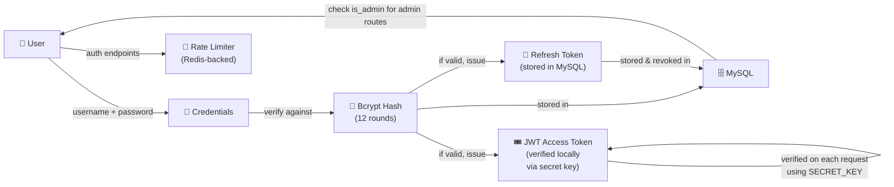

# System Architecture

This document outlines the system architecture of the Real-Time Leaderboard project.

## 🗄️ Entity Relationship Diagram (ERD)



## 🔄 Request-Response Flow

### Authentication Flow



### Score Submission & Real-time Update Flow



## 🏗️ Layered Architecture

```
┌─────────────────────────────────────────────────────┐
│              PRESENTATION LAYER                      │
│   routes/auth.py  routes/game.py  routes/users.py   │
│   routes/leaderboard.py  routes/websocket.py        │
├─────────────────────────────────────────────────────┤
│              APPLICATION LAYER                       │
│  controllers/auth.py  controllers/game.py           │
│  controllers/users.py  controllers/leaderboard.py   │
│  controllers/websocket.py                           │
├─────────────────────────────────────────────────────┤
│              DOMAIN LAYER                            │
│  models/tables.py (SQLAlchemy ORM models)           │
│  models/request.py  models/response.py (Pydantic)   │
├─────────────────────────────────────────────────────┤
│              INFRASTRUCTURE LAYER                    │
│  config/db.py (MySQL + connection pool)             │
│  config/redis.py (sync + async Redis clients)       │
│  config/websocket.py (ConnectionManager)            │
│  config/cloudinary.py  config/mail.py              │
└─────────────────────────────────────────────────────┘
```

## 🔐 Security Architecture



## 🔄 WebSocket Architecture

```
Client A ──WS connect──▶ /ws/{game_name}
Client B ──WS connect──▶ /ws/{game_name}
Client C ──WS connect──▶ /ws/{game_name}
                              │
                              ▼
                    ConnectionManager
                  { game_name: [A, B, C] }
                              │
                   on new high score:
                              │
                    Redis ZREVRANGE ──▶ top 10
                              │
                    send_json to A, B, C
```

The `ConnectionManager` is an in-memory dict mapping game names to lists of active WebSocket connections. When a new high score lands, the leaderboard controller fetches the updated top 10 from Redis and the manager broadcasts it directly to all connected clients for that game.