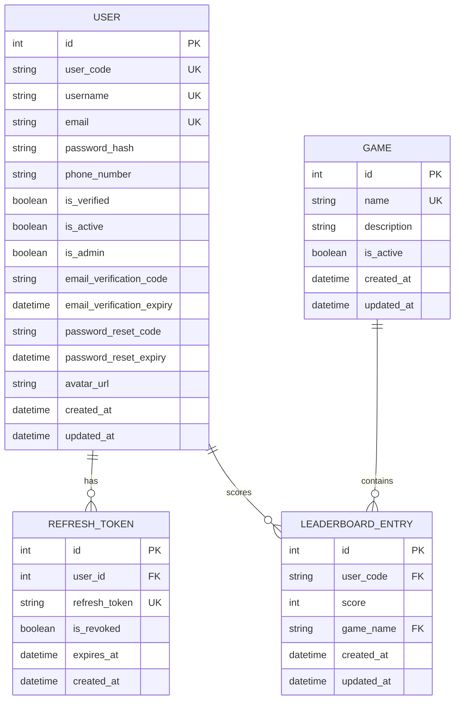
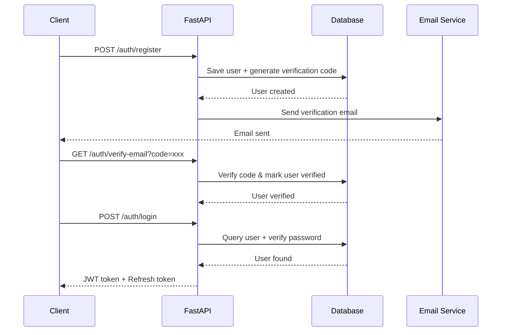
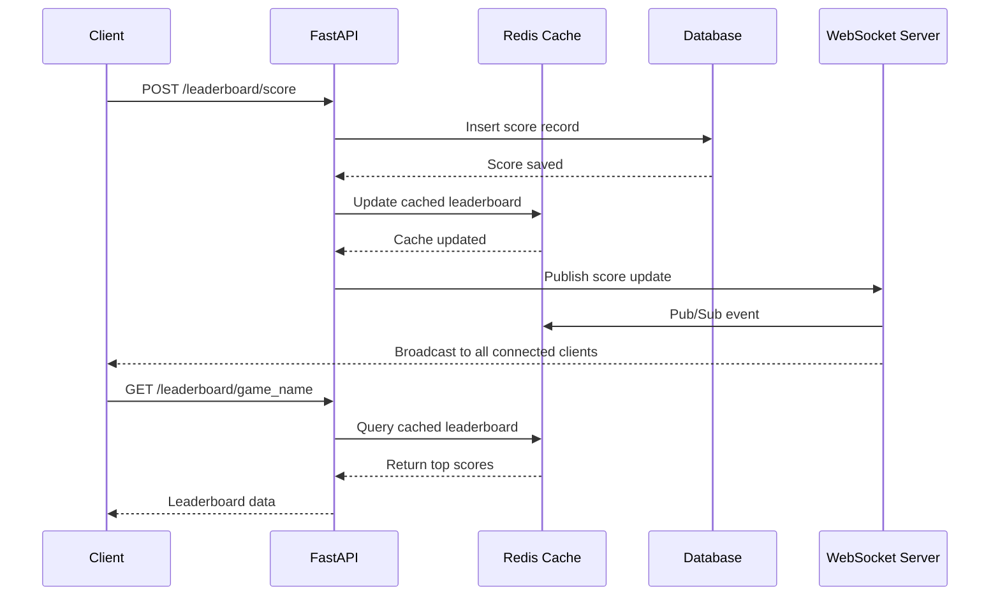
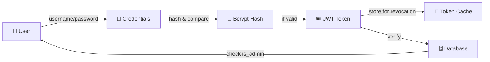

# System Architecture

This document outlines the system architecture of the Real-time Leaderboard project.

## 🗄️ Entity Relationship Diagram (ERD)



## 🔄 Request-Response Flow

### Authentication Flow



### Score Submission & Real-time Update Flow



## 🏗️ Layered Architecture

```
┌─────────────────────────────────────┐
│      🖥️  PRESENTATION LAYER         │
│   (FastAPI Routes & Endpoints)      │
├─────────────────────────────────────┤
│      🎮 APPLICATION LAYER           │
│   (Controllers & Business Logic)    │
├─────────────────────────────────────┤
│      📦 DOMAIN LAYER                │
│   (Models & Data Transfer Objects)  │
├─────────────────────────────────────┤
│      💾 PERSISTENCE LAYER           │
│  (Database & Cache Operations)      │
└─────────────────────────────────────┘
```
## 🔐 Security Architecture

