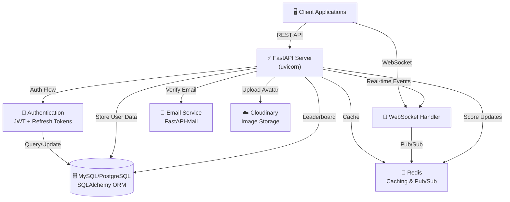
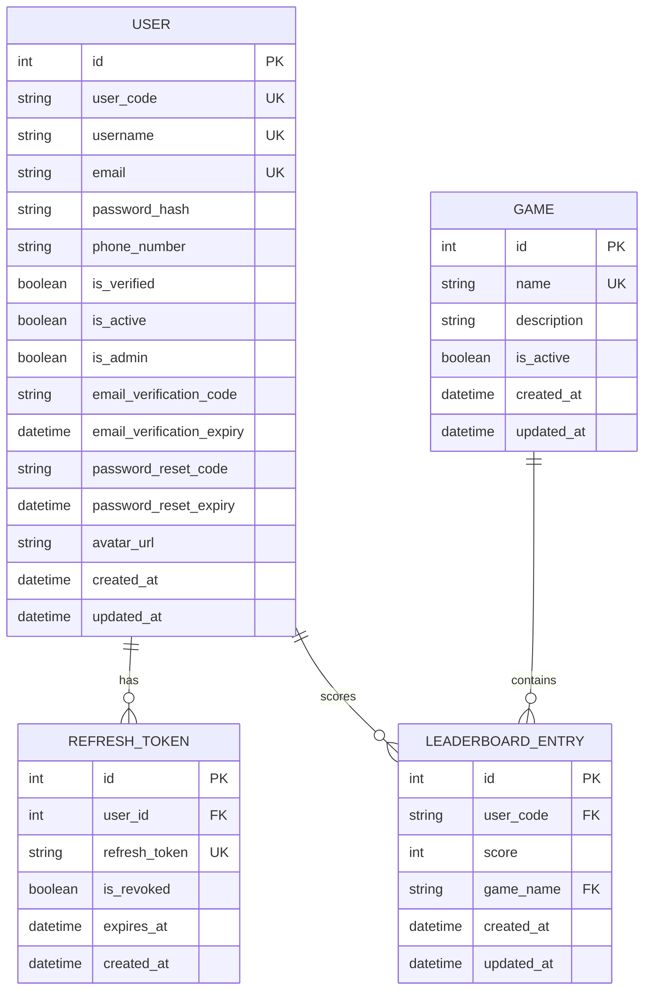
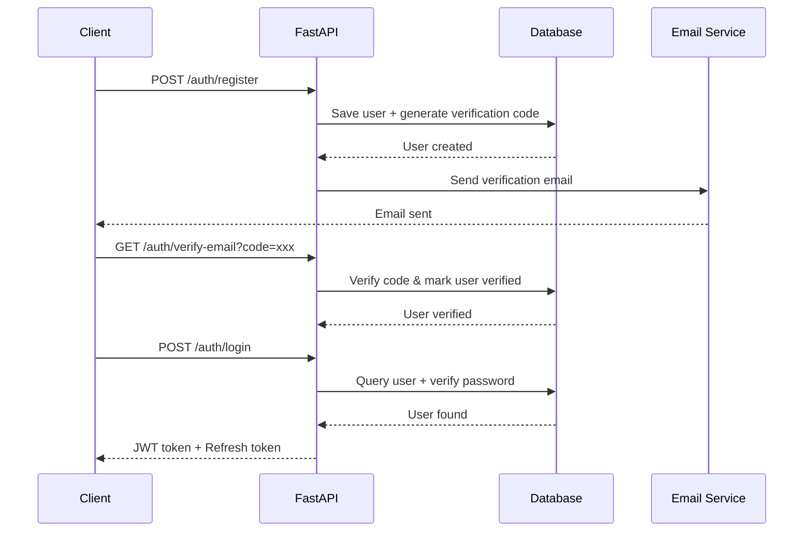
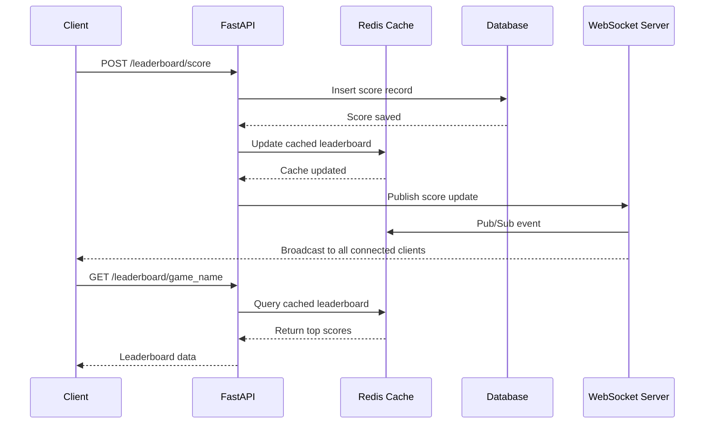
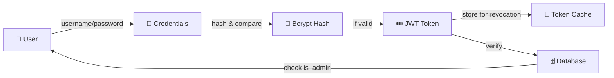
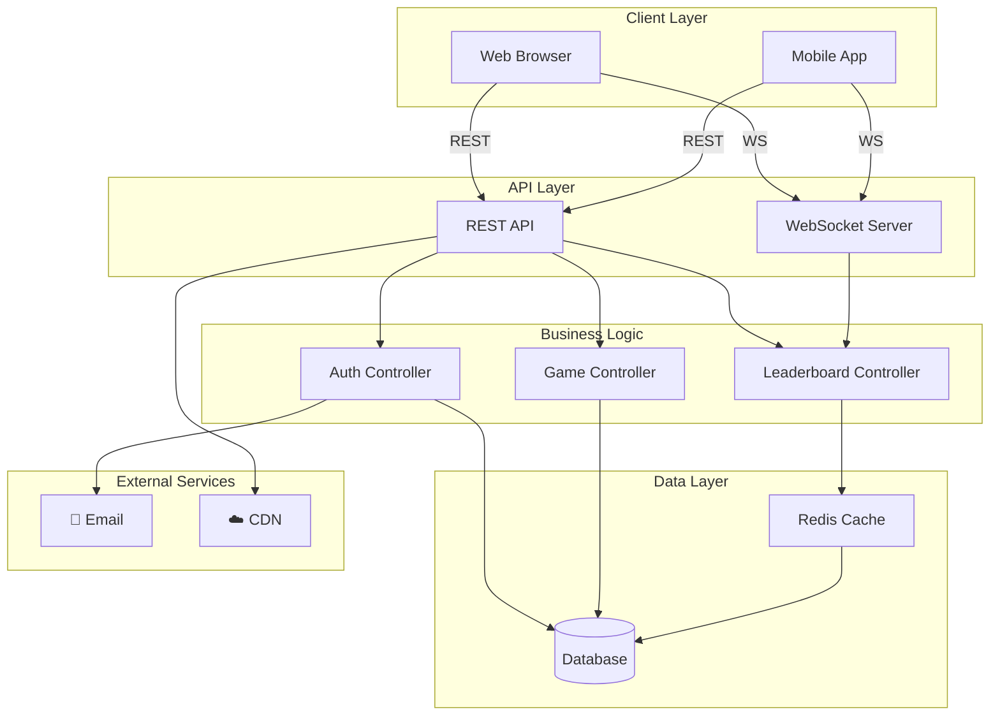
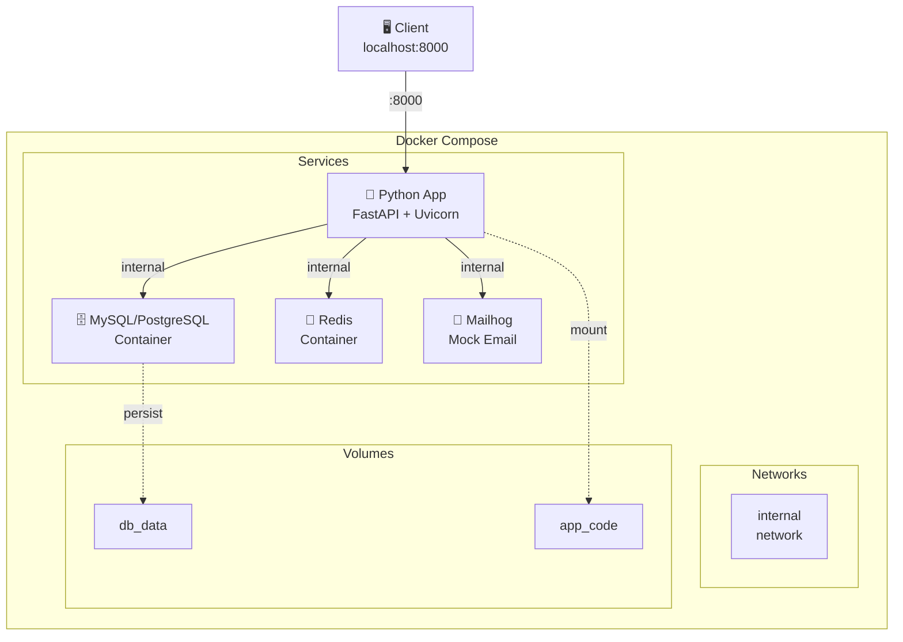

# System Architecture

This document outlines the system architecture of the Real-time Leaderboard project.

## 🏛️ High-Level Architecture



## 🗄️ Entity Relationship Diagram (ERD)



## 🔄 Request-Response Flow

### Authentication Flow



### Score Submission & Real-time Update Flow



## 🏗️ Layered Architecture

```
┌─────────────────────────────────────┐
│      🖥️  PRESENTATION LAYER         │
│   (FastAPI Routes & Endpoints)      │
├─────────────────────────────────────┤
│      🎮 APPLICATION LAYER           │
│   (Controllers & Business Logic)    │
├─────────────────────────────────────┤
│      📦 DOMAIN LAYER                │
│   (Models & Data Transfer Objects)  │
├─────────────────────────────────────┤
│      💾 PERSISTENCE LAYER           │
│  (Database & Cache Operations)      │
└─────────────────────────────────────┘
```

## 📂 Component Structure

### Routes Layer
Handles HTTP requests and WebSocket connections
- `auth.py` - Authentication endpoints
- `users.py` - User management endpoints
- `game.py` - Game CRUD endpoints
- `leaderboard.py` - Leaderboard query endpoints
- `websocket.py` - Real-time connection endpoints

### Controllers Layer
Contains business logic and data validation
- `auth.py` - Authentication logic, token generation
- `users.py` - User operations, validation
- `game.py` - Game creation, activation logic
- `leaderboard.py` - Score processing, ranking
- `websocket.py` - Real-time event handlers

### Models Layer
Defines data structures
- `tables.py` - SQLAlchemy ORM models (User, Game, LeaderboardEntry, RefreshToken)
- `request.py` - Pydantic request schemas for validation
- `response.py` - Pydantic response schemas for serialization

### Config Layer
External service configurations
- `db.py` - Database connection pool & session management
- `redis.py` - Redis sync & async clients
- `mail.py` - Email service configuration
- `websocket.py` - WebSocket connection manager
- `cloudinary.py` - Image upload service

## 🔐 Security Architecture



## ⚡ Performance Optimization

### Caching Strategy
- **Redis Sorted Sets:** Leaderboard rankings
- **Redis Strings:** User session data
- **Database Indexes:** On frequently queried columns (username, user_code, game_name)

### Database Optimization
- Connection pooling with SQLAlchemy
- Foreign key relationships with CASCADE deletion
- Pagination for large result sets
- Query optimization with selective field loading

### Real-time Optimization
- WebSocket pub/sub for efficient broadcasting
- Async Redis for non-blocking operations
- Event-driven architecture for score updates

## 📊 Data Flow Diagram



## 🔄 Deployment Architecture (Docker Compose)



## 🔄 API Request Pipeline

```
Request
   ↓
[1] Route Handler (routes/*.py)
   ↓
[2] Authentication Check (JWT verification)
   ↓
[3] Authorization Check (role-based access)
   ↓
[4] Input Validation (Pydantic schemas)
   ↓
[5] Controller Logic (controllers/*.py)
   ↓
[6] Cache Check (Redis)
   ↓
[7] Database Query (SQLAlchemy)
   ↓
[8] Response Serialization (Pydantic models)
   ↓
Response → Client
```

## 🧵 Concurrency Model

- **FastAPI:** Async I/O with uvicorn workers
- **Database:** Connection pooling (default pool_size=20)
- **Redis:** Async client for non-blocking operations
- **WebSocket:** Async message handling with asyncio
- **Task Scheduling:** APScheduler for background tasks

## 🎯 Key Design Patterns

1. **Repository Pattern:** Database queries abstracted in controllers
2. **Service Layer:** Business logic centralized in controllers
3. **Dependency Injection:** FastAPI's `Depends()` for resource management
4. **Factory Pattern:** Redis client initialization
5. **Observer Pattern:** WebSocket pub/sub for real-time updates
6. **Circuit Breaker:** Graceful error handling in health checks

## 🚀 Scalability Considerations

### Horizontal Scaling
- Stateless API servers (state in Redis/Database)
- Load balancer ready (all clients connect to same endpoints)
- Database replica support

### Vertical Scaling
- Connection pooling for database
- Redis memory optimization
- Async I/O for high concurrency

### Monitoring
- Health check endpoint at `/health`
- Application logging
- Database performance monitoring

---

**For more details on specific components, refer to the source code and inline documentation.**
